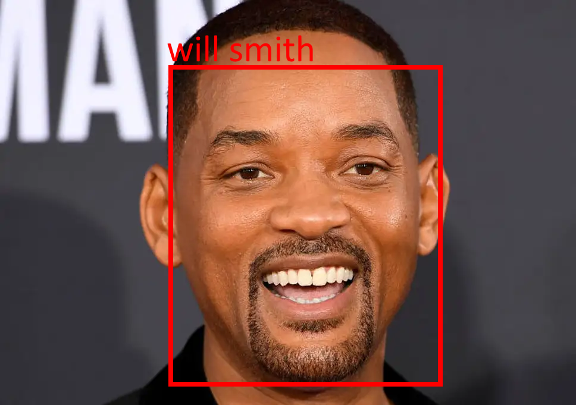

# Face Detection And Recognition

The AI will detect all faces in the scene and create bounding boxes around them, If it detects anyone it display their name next to the bounding box. if it cant identify the person it will display "umkown" next to the bounding box

Example.

Todo:
- Improve performance / Framerate
- Create interface for creating dataset
- Potentially allow user to tag names to unidentified faces
